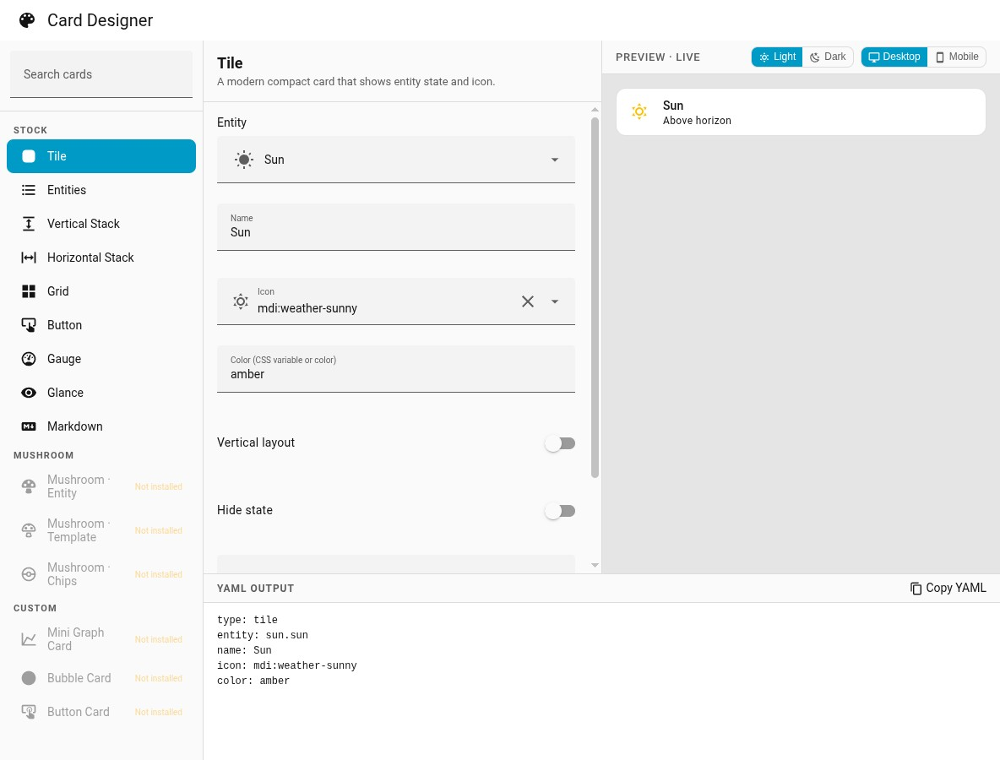
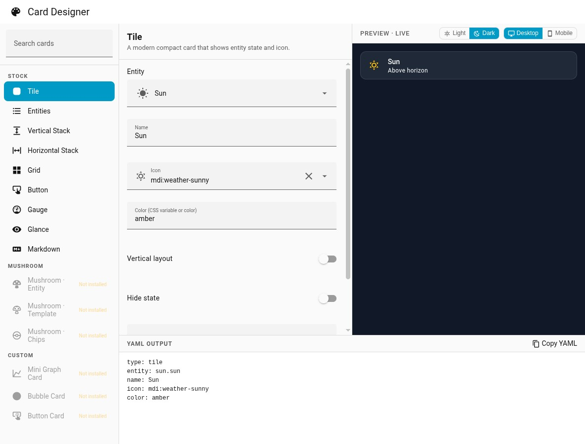

# Card Designer for Home Assistant

A visual Lovelace card designer that lives in your Home Assistant sidebar. Pick a card type, fill in a form, see a **real live preview**, then copy the YAML into any dashboard.

No more trial-and-error YAML editing — what you configure is what you get.



## Features

- **Live preview** — renders the actual HA card element using `createThing()`, exactly as it appears on your dashboard
- **Clean YAML output** — strips defaulted fields, keeps keys in a logical order, ready to paste
- **Light / Dark preview** — toggle dark mode on the preview pane without affecting the rest of HA
- **Desktop / Mobile viewport** — constrain the preview to 375px to check how the card looks on mobile
- **Stock, Mushroom & custom cards** — custom cards show a HACS install hint when not present
- **Stack editors** — Vertical Stack, Horizontal Stack, and Grid have an inline child-card editor with drag-to-reorder



## Supported Cards

| Category | Cards |
|---|---|
| **Stock** | Tile, Entities, Vertical Stack, Horizontal Stack, Grid, Button, Gauge, Glance, Markdown |
| **Mushroom** | Entity, Template, Chips |
| **Custom** | Mini Graph Card, Bubble Card, Button Card |

Custom cards are greyed out and show "Not installed" when their JS bundle is not loaded — clicking them shows a HACS install hint.

## Installation

### HACS (recommended)

1. Open HACS → **Integrations** → ⋮ → **Custom repositories**
2. Add `https://github.com/stevendejongnl/ha-card-designer` as category **Integration**
3. Install **Card Designer** and restart Home Assistant
4. Go to **Settings → Devices & Services → Add Integration** and search for **Card Designer**
5. **Card Designer** appears in the HA sidebar

### Manual (development)

```bash
git clone https://github.com/stevendejongnl/ha-card-designer
cd ha-card-designer
npm install
npm run build
# Copy custom_components/ha_card_designer/ to your HA config directory
# then restart HA and add the integration
```

## Usage

1. Open **Card Designer** from the sidebar
2. Search or scroll to find a card type — Stock, Mushroom, or Custom
3. Fill in the form fields; the preview updates live
4. Use the **Light / Dark** and **Desktop / Mobile** toggles to check how the card looks
5. Click **Copy YAML** and paste into your dashboard card editor

## Development

```bash
npm install
npm run build       # production bundle → custom_components/.../assets/ha-card-designer-panel.js
npm run dev         # watch mode (rebuilds on save)
npm run typecheck   # tsc --noEmit
```

Deploy to a test HA instance:

```bash
scripts/deploy-test.sh   # build → deploy via SSH → restart HA
```

### Adding a card schema

See [`docs/adding-a-card.md`](docs/adding-a-card.md) for the full guide. Adding a card is one file in `src/cards/` plus one line in `src/core/registry.ts`.

## Architecture

```
src/
  cards/          one file per card schema (id, form, defaults, yamlOrder)
  core/
    schema.ts     CardSchema + FormSchema types
    registry.ts   ALL_CARDS master list
    yaml.ts       config → clean YAML (strips defaults, orders keys)
    selectors.ts  ha-form selector shorthand helpers
    widgets.ts    reusable form widgets (entity row list, etc.)
  panel/
    ha-card-designer-panel.ts   root 4-pane component
    cards-list-widget.ts        card list rail with search
    card-preview.ts             live preview (createThing + hass)
    card-form.ts                ha-form wrapper
    yaml-output.ts              YAML output with copy button

custom_components/ha_card_designer/   Python integration (panel + static asset serving)
```

The panel runs in HA's main document (`embed_iframe: false`) so the preview can call `createThing()` and inject `hass` — the same mechanism Lovelace uses to render cards. This gives a pixel-perfect preview with no extra infrastructure.
